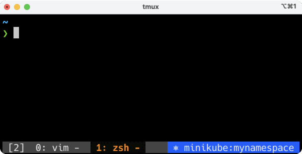

# Tmux Kube Status

`kube_status.tmux` is a Tmux plugin that allows you to display your current Kubernetes context in the Tmux status line. The plugin enables you to change colors based on each context.

## Preview

For a dynamic preview of how `kube_status.tmux` will look and behave, check out the GIF below:



## Installation

### Recommended Method: Using tmux-plugin-manager (TPM)
Use [tmux-plugin-manager (TPM)](https://github.com/tmux-plugins/tpm) for easier installation and management.

1. Add the following line to your `.tmux.conf`:

```bash
set -g @plugin 'masa0221/tmux-kube-status'
```

2. Press `prefix` + <kbd>I</kbd> to fetch and install the plugin.

### Manual Method

1. Clone this repository:

```bash
git clone git@github.com:masa0221/tmux-kube-status.git
```

2. In your `.tmux.conf`, source `kube_status.tmux`:

```bash
run-shell /path/to/tmux-kube-status/kube_status.tmux
```

## Usage

To display your Kubernetes context in the Tmux status line, add this line to your `.tmux.conf`:

```bash
set-option -g status-right "#{kube_status}"
```

### Note on Refresh Rate

To minimize the chance of displaying outdated information, you may optionally set the `status-interval`:

```bash
set-option -g status-interval 1
```

This will refresh the Tmux status line every second.


## Configuration

Here is an example of how to configure kube_status.tmux in your `.tmux.conf` file. If not set, the plugin will use default values:

```bash
set -g @kube-status-format-dev '#[fg=colour255,bg=colour27]'
set -g @kube-status-context-cutoff-length '20'
```

### Configuration Table

| Option                                | Description                                          | Default                        |
|-------------------------------------  |------------------------------------------------------|--------------------------------|
| `@kube-status-format-default`         | Text color and background for default                | `#[fg=colour255,bg=colour27]`  |
| `@kube-status-format-dev`             | Text color and background for dev environment        | `#[fg=colour255,bg=colour27]`  |
| `@kube-status-format-test`            | Text color and background for test environment       | `#[fg=colour255,bg=colour28]`  |
| `@kube-status-format-stage`           | Text color and background for staging environment    | `#[fg=colour255,bg=colour136]` |
| `@kube-status-format-prod`            | Text color and background for prod environment       | `#[fg=colour255,bg=colour200]` |
| `@kube-status-context-cutoff-length`  | Max length for Kubernetes context name               | `20`                           |
| `@kube-status-namespace-cutoff-length`| Max length for Kubernetes namespace                  | `20`                           |
| `@kube-status-empty-context-string`   | String when no Kubernetes context is available       | `-`                            |
| `@kube-status-dev-pattern`            | Regex pattern for dev environment                    | `.*dev.*`                      |
| `@kube-status-test-pattern`           | Regex pattern for test environment                   | `.*test.*`                     |
| `@kube-status-stg-pattern`            | Regex pattern for staging environment                | `.*stg.*\|.*stage.*`           |
| `@kube-status-prod-pattern`           | Regex pattern for production environment             | `.*prod.*`                     |

### Troubleshooting

If your settings do not seem to take effect, you can verify the current values with `tmux show-option`. For example, to check the value of `@kube-status-format-dev`, you can use:

```bash
tmux show-option -gqv @kube-status-format-dev
```
This will show you the current setting, helping you to debug any configuration issues.


## Debugging

Use `--debug` and `--debug-with-color-code` flags with `tmux_kube_status.sh` for debugging.

## Contributing

Open an issue or submit a pull request if you'd like to contribute.

## License

MIT
